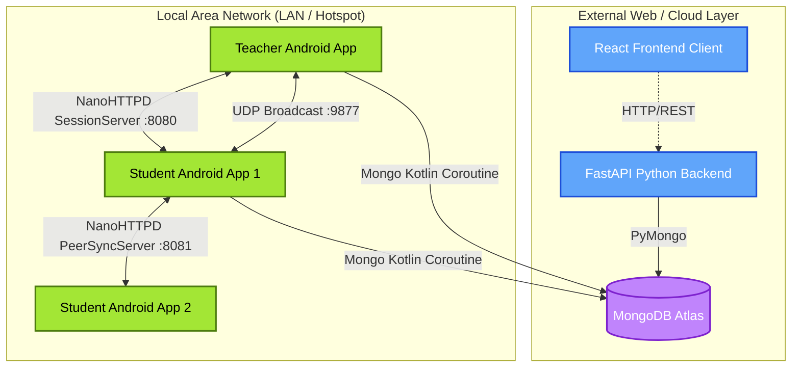

# EduNet Lab Portal
LAN-Based Practical Lab Management System & Peer-to-Peer Android Client

EduNet Lab Portal is a robust college lab management system that enables staff to conduct practical sessions and students to enroll in subjects and submit lab work. The system is multifaceted, utilizing a **Python/FastAPI** backend for web clients, a **MongoDB Atlas** cloud database for state persistence, and a native **Kotlin Android** application equipped with decentralized Peer-to-Peer (P2P) file sharing for offline or low-bandwidth environments.

---

## 🚀 Key Features

- **Role-Based Authentication:** Direct support for Teacher and Student profiles with secure session management.
- **Python FastAPI REST Backend:** Fast, asynchronous, and auto-documented (Swagger UI) API layer.
- **Native Android Client (Jetpack Compose):** A modern, responsive mobile app that interfaces directly with MongoDB and local network peers.
- **Zero-Config P2P Discovery (UDP):** Android devices can automatically discover active Lab Sessions hosted by Teachers utilizing UDP sub-net broadcasting and direct IP probing (saving bandwidth).
- **Offline File Distribution (NanoHTTPD):** Teachers distribute files to students directly over the Local Area Network (LAN/Hotspots) without requiring external internet. Students sync files locally via embedded NanoHTTPD servers.

---

## 🏗 High-Level Architecture



---

## 🛠 Technology Stack

### Cloud & Database
- **Database:** MongoDB Atlas (Cloud NoSQL)
- **Schema:** Dynamic Collections (`users`, `subjects`, `subject_enrollments`)

### Web Backend
- **Framework:** Python 3.11+ with FastAPI
- **Driver:** PyMongo 4.7 (SRV Support)
- **Validation:** Pydantic v2
- **Server:** Uvicorn (ASGI)

### Mobile Client (Android)
- **Language:** Kotlin
- **UI Toolkit:** Jetpack Compose (Material 3)
- **Database Driver:** MongoDB Kotlin Coroutine Driver
- **Networking:** NanoHTTPD (Embedded Servers), `DatagramSocket` (UDP)
- **Concurrency:** Kotlin Coroutines (`Dispatchers.IO`)

---

## 📡 API Endpoints (FastAPI)

| Method | Endpoint                          | Description                              |
|--------|-----------------------------------|------------------------------------------|
| GET    | `/health`                         | Health check confirming Uvicorn status   |
| POST   | `/login`                          | Login for students/teachers              |
| POST   | `/signup`                         | Account creation                         |
| GET    | `/student/subjects/{student_id}`  | Retrieve student's enrolled subjects     |
| POST   | `/student/join`                   | Enroll dynamically using a subject code  |
| GET    | `/teacher/subjects/{teacher_id}`  | Retrieve subjects authored by teacher    |
| POST   | `/teacher/subjects`               | Create a new class/subject               |

---

## 📱 Android P2P Workflow

1. **Teacher Initialization:** A teacher opens the Android app, selects a subject, and starts a "Lab Session". The app spins up a `SessionServer` on port `8080` (NanoHTTPD) and begins UDP broadcasting on port `9877`.
2. **Student Discovery:** A student app listens for the UDP broadcast or probes known hotspot gateways (e.g., `192.168.43.1:8080`).
3. **P2P Transfer:** Once connected, the student downloads assignment files directly from the teacher's phone over the LAN, eliminating the need to download 50MB PDFs over a slow mobile data connection.
4. **Peer Syncing:** Students simultaneously run a `PeerSyncServer` on port `8081` to share previously downloaded logs or files with other students bridging network gaps.

---

## 💻 Setup Instructions

### 1. Python Backend Installation
```bash
cd backend
python -m venv venv
# Windows: venv\Scripts\activate
# Unix: source venv/bin/activate
pip install -r requirements.txt
uvicorn main:app --reload --port 8000
```
Interactive API docs available at `http://localhost:8000/docs`.

### 2. Android Studio Setup
1. Open the `/Android` folder in **Android Studio** (Koala or newer recommended).
2. Sync the Gradle project.
3. Plug in a physical Android device or launch an emulator.
4. Run the `app` configuration.

### 3. Frontend Web Setup (Standalone)
If running the React frontend (housed in the sibling directory `../Technathon 3.0 Wasim/webpage`):
```bash
cd "../Technathon 3.0 Wasim/webpage"
npm install
npm run dev
```

---

## 🔒 Security Notes
- **Direct Database Connections:** The Android client currently utilizes a direct MongoDB Atlas connection string. In a full production launch, this should be proxied completely through the FastAPI backend to protect database credentials.
- **Passwords:** Currently implementing plaintext storage for hackathon testing purposes. Pre-production requires `bcrypt` hashing.

## 👥 Contributors
Aman Shaikh • Wasim Pathan • Omkar Gondkar • Atharva Mashale
