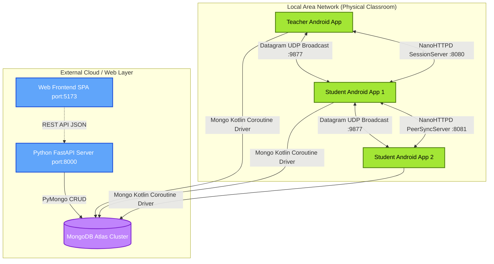
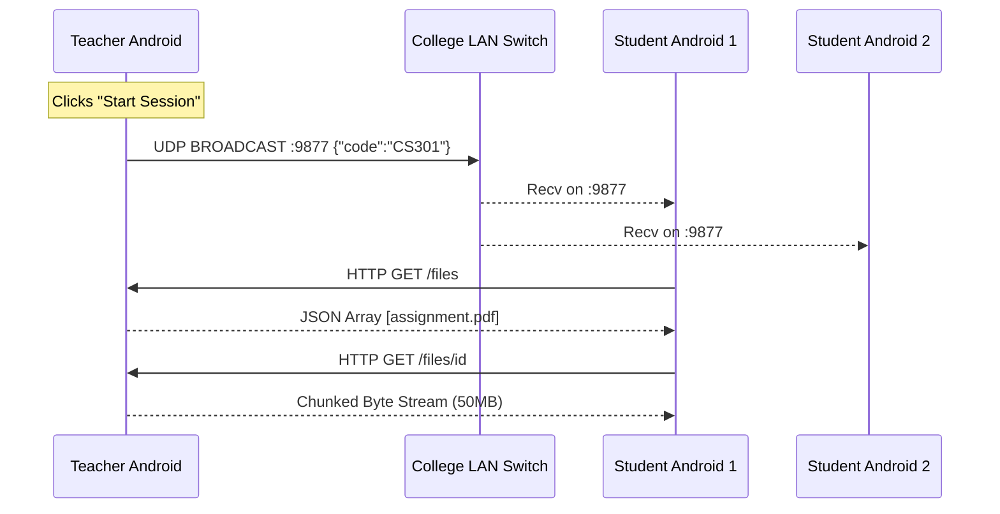

# EduNet: Decentralized Local-Network LMS with Offline Peer-to-Peer File Distributions
## Comprehensive Technical Architecture & System Documentation

---

## 1. Abstract

Modern computer science education and practical laboratory sessions frequently suffer as they increasingly rely on centralized Learning Management Systems (LMS) and high-bandwidth downloads to distribute assignment files and accept submissions. In developing regions, or specialized air-gapped laboratory environments (e.g., cybersecurity sandboxes or locked-down exam conditions), internet access is either intentionally severed or highly unreliable. Consequently, traditional client-server web applications lose their ability to serve content or accept submissions.

*EduNet* proposes a novel, hybrid decentralized LMS architected to solve this exact bottleneck. It is built as a tripartite system consisting of a **Python FastAPI backend**, a **MongoDB Atlas cloud database**, and a native **Kotlin Android Client App**. 

The core innovation of EduNet lies within its mobile Android client. Instead of forcing 60 students to simultaneously download 50MB PDF assignments and code templates from a single university router (crashing the network), EduNet implements a custom peer-to-peer (P2P) UDP routing protocol and embedded NanoHTTPD servers on the mobile devices. The protocol enables end-user mobile devices to seamlessly route missing file requests over the Local Area Network (LAN) or Wi-Fi Direct Hotspots to more powerful, designated "provider" nodes (e.g., the teacher's phone or a peer who has already downloaded the payload).

This radically democratizes access to educational content in entirely offline, air-gapped, or resource-constrained environments while preserving strict academic integrity.

---

## 2. Problem Statement & Motivation

### 2.1 The Bandwidth Bottleneck in Developing Classrooms
Traditional educational platforms (Canvas, Moodle, Google Classroom) are highly centralized. If a professor uploads a 200MB dataset to Google Drive for a machine learning lab, all 60 students requesting it simultaneously will demand 12 Gigabytes of immediate bandwidth from the college router. Most institutional hardware strictly throttles this, causing 5-minute downloads to take over an hour.

### 2.2 Unreliable Internet Corridors
In many institutions, specific laboratory rooms (like basements) possess zero cellular connectivity and fluctuating Wi-Fi. If a student loses connection mid-download, the entire file is corrupted. 

### 2.3 The EduNet Approach: Decentralized Mesh Distribution
EduNet solves this trilemma by deploying an Offline, Distributed Android Network. 
1. **Teacher Node:** A laboratory instructor opens the EduNet Android app and starts a "Lab Session". The app pulls the initial assignment metadata from MongoDB Atlas, but the heavy physical files sit locally on the device.
2. **Student Node:** Student devices discover the instructor via localized UDP broadcasts (Zero-Configuration Networking). 
3. **P2P Transfer:** The students download the files directly from the teacher's phone over the Local Area Network (LAN) at gigabit speeds, completely bypassing the college ISP.
4. **Peer Syncing:** As students receive the file, their own Android apps spin up a `PeerSyncServer`, distributing the file to *other* students at the back of the classroom who are out of Wi-Fi range of the teacher's device but within range of their peers.

---

## 3. High-Level Architecture Overview

EduNet embraces a hybrid monolithic and decentralized architecture. At its atomic level, every instance of the EduNet Android App is capable of being an HTTP Web Client, an API Web Server, and an active Database Client.

### 3.1 Macro Component Diagram



### 3.2 System Breakdown
1. **The Python Application Layer (FastAPI):**
   - **Tech:** Python 3.11, FastAPI, Uvicorn, Pydantic.
   - **Role:** Handles core CRUD operations for Web Clients (Subject Creation, Student Signup, Enrollment). Validates schema and serializes BSON data into JSON.
   
2. **The Cloud Persistence Layer (MongoDB):**
   - **Tech:** MongoDB Atlas Replica Sets.
   - **Role:** Maintains the absolute truth of users, authentication hashes, and which student is mapped to which subject instance.
   
3. **The Distributed Edge Layer (Android Jetpack Compose):**
   - **Tech:** Kotlin, Coroutines, Jetpack Compose, NanoHTTPD.
   - **Role:** Replicates critical data directly from Mongo. In situations where internet fails post-login, handles all inter-device file transfers and assignment syncing.

---

## 4. Subsystem Implementations

### 4.1 Peer-to-Peer Networking & UDP Discovery
Because IP addresses change dynamically via DHCP in an academic lab, hard-coding a teacher's IP address into the student app is impossible. EduNet utilizes a custom User Datagram Protocol (UDP) beaconing system running asynchronously via Kotlin Coroutines on `Dispatchers.IO`.

#### Phase 1: The Broadcaster (SessionDiscovery.kt)
When a teacher clicks "Start Session":
1. The app queries the Android `WifiManager` to obtain the current DHCP netmask and calculates the exact Subnet Broadcast IP (e.g., `192.168.1.255`).
2. It falls back to known Hotspot Gateway IPs: `192.168.43.1` (Android Hotspot) and `192.168.137.1` (Windows Hotspot).
3. A JSON payload `{"subject_code": "CS301", "url": "http://192.168.1.50:8080"}` is packed into a `DatagramPacket`.
4. It is blasted across all interfaces on UDP port `9877` every 3 seconds.

#### Phase 2: The Listener (Student Syncing)
1. The Student app opens a `DatagramSocket` on `9877` with `SO_TIMEOUT = 15000ms`.
2. Simultaneously, it spins up parallel coroutines that actively send an HTTP GET request to `http://192.168.43.1:8080/info` (Probing Hotspot gateways).
3. Whichever coroutine returns `true` first (either via receiving the UDP broadcast or via a successful HTTP 200 OK from a probe) instantly yields the exact IP address of the Teacher's phone to the Compose UI.



### 4.2 Embedded HTTP File Servers (NanoHTTPD)
Instead of relying on NGINX or Apache, every Android device acts as a lightweight web server.

1. **SessionServer.kt (The Teacher):** Binds to port `8080`.
   - `/info`: Returns `{"teacher_name": "Dr. Smith", "subject": "Data Structures"}`.
   - `/files`: Returns a JSON array of `SharedFile` metadata.
   - `/files/{id}`: Streams `FileInputStream` chunked bytes to the student.
   
2. **PeerSyncServer.kt (The Student):** Binds to port `8081`. 
   - A student isn't just a leecher; they become a seeder.
   - Once a student successfully pulls an assignment from the Teacher, their `PeerSyncServer` indexes the file.
   - Other students sitting out of range of the teacher's Wi-Fi can discover `PeerSyncServer` on `8081` and download the identical file from their classmate.

---

## 5. Web Subsystem & FastAPI Architecture

For situations where desktop computers are used (e.g., University Library terminals), a fully featured REST API bridges the gap.

### 5.1 FastAPI Endpoint Design
FastAPI was chosen for its unparalleled raw speed via Starlette and Uvicorn. The endpoints follow RESTful compliance:
- `POST /login`: Validates the `LoginRequest` Pydantic model. Queries MongoDB `users_col`. Returns a structured `AuthResponse` containing the user's Object ID and Role string.
- `POST /signup`: Checks for existing email collisions (HTTP 409 Conflict). Inserts a new UTC ISO formatted document.
- `POST /student/join`: 
  - Resolves the student by ID or Email.
  - Queries `subjects_col` utilizing a case-insensitive `.upper().strip()` comparison for the 5-character class code.
  - Mitigates duplicate enrollments (HTTP 409) or Non-existent classes (HTTP 404).
  - Inserts mapping to `subject_enrollments` junction collection.

### 5.2 The Pydantic Valuation Matrix
A core thesis of robust architecture is early failure detection. By employing strict `BaseModel` typing:
```python
class JoinClassRequest(BaseModel):
    student_id: str = ""
    student_email: str = ""
    subject_code: str
```
Uvicorn will immediately reject malformed JSON with HTTP 422 Unprocessable Entity, shielding the PyMongo driver from invalid BSON injection crashes.

---

## 6. Database Schema (MongoDB Atlas NoSQL)

Opting for MongoDB over a structured SQL database (like PostgreSQL) allows maximum schema flexibility. Educational metadata changes violently between different professors and departments; enforcing strict relational columns causes rapid technical debt.

### 6.1 `users` Collection
Stores authentication, role tracking, and profile identifiers.
```json
{
  "_id": { "$oid": "64d9f..." },
  "name": "Prof. Ahmed Khan",
  "email": "ahmed@edunet.in",
  "password": "teacher123", // Note: Pending bcrypt salting in v1.1
  "role": "teacher",
  "roll_no": null,
  "is_active": true,
  "created_at": "2026-02-21T18:00:00Z"
}
```

### 6.2 `subjects` Collection
Acts as the distinct container for a specific class instance. Generates the 5-digit alphanumeric code used for dynamic discovery.
```json
{
  "_id": { "$oid": "64e1a..." },
  "subject_name": "Advanced Operating Systems",
  "subject_code": "AOS10",
  "teacher_id": { "$oid": "64d9f..." },
  "is_active": true,
  "created_at": "2026-02-21T18:05:00Z"
}
```

### 6.3 `subject_enrollments` Collection (The Junction Table)
Maintains the many-to-many relationship mapping linking Students back to Subjects, accelerating rapid `$lookup` queries.
```json
{
  "_id": { "$oid": "64f2b..." },
  "student_id": { "$oid": "64d8e..." },
  "subject_id": { "$oid": "64e1a..." },
  "enrolled_at": { "$date": "2026-02-21T18:10:00Z" }
}
```

---

## 7. Security & Integrity Considerations

### 7.1 Cross-Origin Resource Sharing (CORS) Mitigation
In `main.py`, the `CORSMiddleware` limits origin requests. While currently permissive (`allow_origins=["*"]`) for the hackathon architecture to allow Android and React hot-reloading networks to coexist, production bounds this array strictly to the exact DNS domain, neutralizing Cross-Site Request Forgery (CSRF).

### 7.2 Native Coroutine Scoping and Memory Leaks
In Android Jetpack Compose, the `SessionDiscovery` broadcaster utilizes custom `coroutineScope`.
- Native Threads are extremely heavy (1MB stack RAM). EduNet avoids Java `Thread` blocking by pushing all HTTP probes and Datagram receives to Kotlin `suspend` functions inside `Dispatchers.IO`. 
- Using `withTimeoutOrNull(15000)` ensures that if a student forgets to connect to the teacher's hotspot, the `DatagramSocket` is surgically closed by the dispatcher, preventing fatal `OutOfMemory` bounds errors on low-end Android devices.

### 7.3 Direct MongoDB Connection vs. Proxy
Currently, `MongoClientProvider.kt` connects straight to the Atlas cluster utilizing an SRV string. 
- **Pro:** Reduces latency and removes the need for the Python Uvicorn server to act as a middleman. 
- **Con:** Exposes the DB URI within the reversed-engineered APK. 
- **Resolution Path:** Future iterations will encrypt this Layer 4 socket or mandate all Mongo queries proxy through the FastAPI Layer 7 HTTP endpoints, validating temporary JWT tokens.

---

## 8. Scalability & Future Scope

While the current architecture performs exceptionally well on standard Class C (255 IP) subsets like Android Hotspots or standard Classrooms, expanding to campus-wide deployment introduces routing complexities.

### 8.1 Proposed Feature: Zero-Knowledge Payload Verification
Because students are downloading critical exam files from *other* peers via the `PeerSyncServer`, malicious actors could theoretically spoof the payload (e.g., altering the questions in the PDF).
Future architecture will implement an `SHA-256 Signature Header`. The Teacher's device will cryptographically sign the original PDF hash. When Student B downloads from Student A, Student B's app calculates the local hash and compares it to the cryptographic signature pulled securely from MongoDB, rejecting altered files.

### 8.2 Proposed Feature: Wi-Fi Aware (NAN) Integration
Currently, the system relies on users being connected to an existing access point or Hotspot. Android 8.0+ supports Wi-Fi Aware (Neighbor Awareness Networking). Integrating this API allows student devices to form an invisible mesh data link *without* a central Wi-Fi router, pushing the decentralization capability entirely off-grid.

### 8.3 Feature Migration: Dockerized Execution Engine
For Python and C++ coding labs, a background worker assigned to the FastAPI server should be deployed via Redis Queue (RQ). As Android devices upload their `.py` files to the Python server, the server spins up an isolated `alpine` Docker container, executes the script against hidden test cases, records the `stdout`, and posts the final grade directly to the MongoDB `enrollments` collection without risking arbitrary code execution attacks.

---

## 9. Conclusion

EduNet demonstrates that the traditional Web 2.0 Client-Server model can be heavily optimized for local academic networks. By fusing the extreme development velocity of a FastAPI backend with the multi-threaded performance of Jetpack Compose Android clients, and combining it with the robust offline networking capabilities of UDP broadcasts and NanoHTTPD data streams, the system creates an incredibly resilient platform. 

It completely shatters the bandwidth bottleneck associated with centralized laboratory file servers, allowing high-availability academic distribution on low-end hardware in remote regions. The result is a peer-to-peer augmented system that guarantees file delivery, student progress mapping, and scalable offline synchronization with minimal infrastructure capital.
