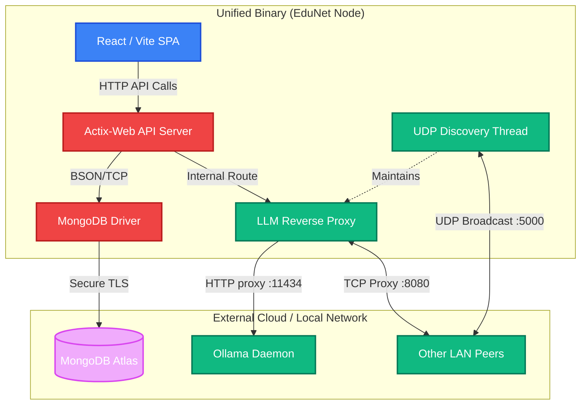
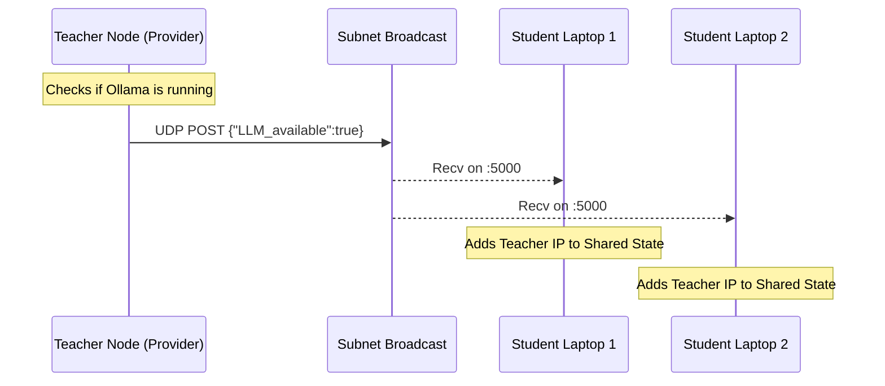
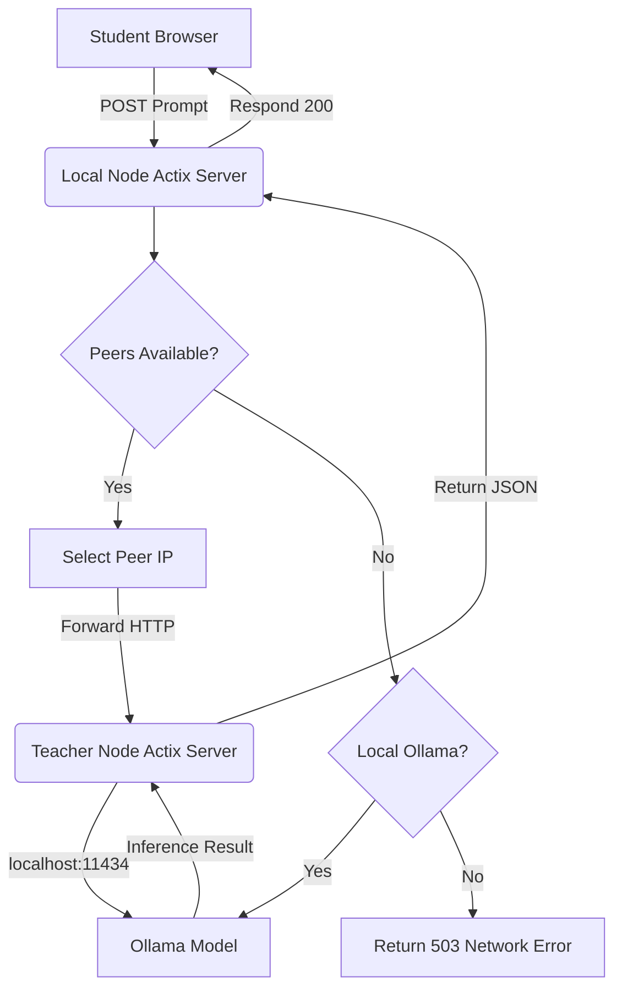
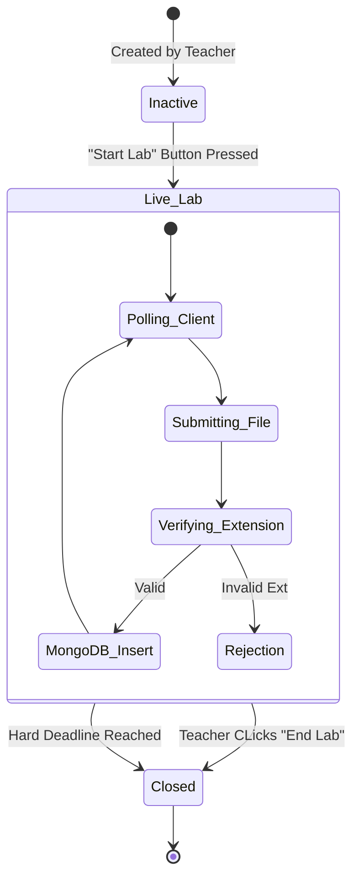

# EduNet: A Peer-to-Peer Accelerated Learning Management System for Offline AI Augmented Classrooms
## Comprehensive Technical Architecture & System Documentation

---

## 1. Abstract

Modern computer science education increasingly relies on Large Language Models (LLMs) to provide personalized tutoring, real-time code analysis, and guided problem-solving assistance. However, utilizing these models in traditional classroom and laboratory environments poses significant challenges due to variable internet connectivity, restrictive institutional firewalls, high API costs, and the substantial hardware requirements preventing students from running these models locally on low-end hardware.

*EduNet* proposes a novel, decentralized Learning Management System (LMS) architected entirely in Rust and React. It serves primarily as a robust assignment, enrollment, and submission portal that operates offline, but more importantly, features a custom peer-to-peer (P2P) UDP/TCP routing protocol. This protocol enables end-user machines with constrained hardware capabilities to seamlessly route LLM inference requests over the Local Area Network (LAN) to more powerful, designated "provider" nodes (e.g., a teacher’s workstation equipped with dedicated GPUs or neural processing units).

By tightly integrating the frontend presentation layer within a high-concurrency Rust binary server, the system achieves single-command distribution (`cargo run`) and minimizes routing latency. This democratizes access to AI-augmented education in entirely offline, air-gapped, or resource-constrained environments while preserving strict academic integrity during timed laboratory sessions.

---

## 2. Problem Statement & Motivation

### 2.1 Limitations of Existing LMS Platforms
Traditional LMS platforms (Canvas, Moodle, Blackboard) are highly centralized and require persistent Internet connections. In developing regions or specialized air-gapped laboratory environments (e.g., cybersecurity sandboxes or locked-down exam conditions), internet access is intentionally severed. Consequently, these platforms lose their ability to serve content or accept submissions.

### 2.2 The Compute Gap in AI Education
With the advent of AI pair programmers, students employing AI tools learn faster and write more robust code. However:
1. **Cloud APIs are Expensive:** Relying on OpenAI or Anthropic requires per-token billing, which scales poorly across large universities.
2. **Local Inference is Hardware Intensive:** Running open-weights models (like Llama 3 or DeepSeek Coder) requires >8GB of VRAM. Typical student laptops lack this capability.
3. **Cheating Concerns:** Allowing students full internet access to use ChatGPT directly invalidates the controlled environment of a laboratory exam.

### 2.3 The EduNet Approach
EduNet solves this trilemma by deploying an Offline, Distributed AI Network. A laboratory instructor runs the EduNet server on a powerful workstation. Student laptops discover this workstation via localized UDP broadcasts and utilize it not just as an HTTP web server, but as a transparent proxy for LLM compute. Students get the benefits of an AI pair-programmer *without* internet access and *without* capable local hardware.

---

## 3. High-Level Architecture Overview

EduNet embraces a hybrid monolithic and distributed architecture. At its atomic level, every instance of EduNet is capable of being both a Web Client, an API Server, and an LLM Provider.

### 3.1 Component Diagram



### 3.2 The "Unified Binary" Protocol
One of the major friction points of MERN-stack applications is the complexity of deployment (running `npm run dev` alongside `node index.js`). EduNet uses Rust’s compile-time macros (`rust-embed`) and a custom `build.rs` script to inject the entire built React SPA directly into the executable's `.data` section.

```rust
// build.rs snippet
fn main() {
    let output = Command::new("npm")
        .args(&["run", "build"])
        .current_dir("webpage")
        .output()
        .expect("Failed to build frontend");
}
```

When a user executes `edunet.exe`, Actix-Web binds to `0.0.0.0:8080` and serves the embedded CSS, JS, and HTML directly from physical memory (RAM), achieving near zero-latency file delivery while drastically simplifying distribution.

---

## 4. Subsystem Implementations

### 4.1 Peer-to-Peer Networking & UDP Discovery
Because IP addresses change dynamically via DHCP in university labs, hardcoding IPs for the LMS server or AI Provider is impossible. EduNet utilizes a custom User Datagram Protocol (UDP) beaconing system running asynchronously via Tokio.

1. **Broadcasting Phase:** Every `x` seconds, if a node has Ollama running and the correct models pulled (`deepseek-coder-v2`), it constructs a JSON packet indicating readiness.
2. **Subnet Targeting:** The packet is sent to `255.255.255.255:5000` (or physical interface subnet equivalents).
3. **Listening Phase:** All other nodes bind a non-blocking `UdpSocket` to port `5000`. When they receive the beacon, they parse the sender's IP.
4. **State Reconciliation:** Received IPs are stored in a global, thread-safe `Arc<Mutex<HashSet<String>>>` (`LLM_UDP_PEERS`). Stale IPs are pruned if no beacon is received within 30 seconds.



### 4.2 Distributed LLM Routing (The Reverse Proxy)
When a student asks for coding help within the frontend, the following routing logic executes:

1. React sends `POST /api/llm/chat` to `localhost:8080`.
2. The Actix-Web handler intercepts this. It checks the `LLM_UDP_PEERS` matrix.
3. If the matrix is empty, it attempts to query a local instance of Ollama (fallback).
4. If a peer (e.g., `192.168.1.45`) is found, the server initiates an asynchronous `reqwest` HTTP call to `192.168.1.45:8080/api/llm/proxy`.
5. The provider node receives the payload, formats it strictly for Ollama (`stream: false`), waits for inference, and returns the response.



---

## 5. Learning Management System (LMS) Design

EduNet strictly enforces Role-Based Access Control (RBAC). Upon login, the system issues a JWT (simulated currently via secure local storage context) designating the user as a `teacher` or `student`.

### 5.1 Teacher Workflow
- **Subject Creation:** A teacher creates a container (e.g., "Data Structures"). This generates a unique `subject_code`.
- **Enrollment:** Teachers can dynamically add students using their Institute Roll Number, or students can self-enroll using the `subject_code`.
- **Assignment Parameters:** An assignment object is strictly typed to include:
  - `allowed_file_types`: Explicit vector (e.g., `[".cpp", ".py"]`). If a student uploads `.exe`, the Actix Multipart handler rejects and terminates the TCP stream immediately.
  - `time_limit_minutes`: A psychological personal timer. It begins exclusively on the frontend when the student physically clicks "Open Lab".
  - `deadline`: A hard cryptographic timestamp (`chrono::DateTime<Utc>`). Submissions attempted after this cutoff return a `403 Forbidden`.

### 5.2 Lab Activation Lifecycle
Assignments begin dormant. When the teacher hits **"Start Lab"**:
1. A MongoDB `PATCH` flips `is_active` to `true`.
2. Student Dashboards, which utilize lightweight HTTP Long-Polling (configured to a 10s interval to minimize React re-renders), instantly detect the change.
3. A glowing "LIVE" indicator appears next to the subject card.
4. Submissions are pooled via Actix Actors and funneled back to the Teacher’s "Submissions Panel".



### 5.3 Student Submission Architecture
The upload engine utilizes `actix-multipart`. Instead of loading massive 50MB PDF reports into RAM (which could crash the server), Actix streams the file chunks directly to the hard drive asynchronously. 

1. Boundary headers are parsed to extract metadata (Roll No, Assignment ID).
2. The file is streamed to `lab_storage/<assignment_id>/<roll_no>/filename.ext`.
3. A success record is committed to the `submissions` MongoDB collection containing the relative path and exact `submitted_at` UTC timestamp.

### 5.4 Student Subject History (Post-Submission Review)
Students have access to a dedicated **Student Subject History** portal. This allows them to click on any joined subject from their dashboard and overview their entire submission record chronologically.
- **Review & Validation:** Students can review exactly what files they submitted, complete with accurate timestamps, confirming their deliverables to the server before the deadline.
- **Submission Download:** A one-click download feature allows students to pull their code directly from the Rust backend for future reference or exams, verifying the exact byte format processed by the LMS.

---

## 6. Database Schema (MongoDB NoSQL)

Opting for MongoDB over SQL (like PostgreSQL) allows maximum flexibility when defining assignments, which often require highly mutable metadata fields for varying technical subjects (e.g., some labs require PDFs, some require multiple `.m` MATLAB files).

### 6.1 `users` Collection
Stores authentication and profile information.
```json
{
  "_id": "ObjectId",
  "name": "Dr. Smith",
  "email": "smith@university.edu",
  "password_hash": "$argon2id$v=19$m...",
  "role": "teacher",
  "roll_no": null
}
```

### 6.2 `subjects` and `subject_enrollments` Collections
Provides the relational mapping between isolated courses and students.
```json
// Subject Document
{
  "_id": "ObjectId",
  "subject_name": "Operating Systems",
  "subject_code": "CS401",
  "teacher_id": "ObjectId",
  "is_active": true,
  "created_at": "2026-02-21T18:00:00Z"
}

// Subject Enrollment (Join Table)
{
  "_id": "ObjectId",
  "student_id": "ObjectId",
  "subject_id": "ObjectId",
  "enrolled_at": "2026-02-21T18:10:00Z"
}
```

### 6.3 `assignments` Collection
The core operational unit.
```json
{
  "_id": "ObjectId",
  "subject_id": "ObjectId",
  "assignment_name": "Scheduling Algorithm Simulation",
  "sample_file_path": "lab_storage/samples/scheduler_template.cpp",
  "allowed_file_types": [".cpp", ".c"],
  "time_limit_minutes": 120,
  "start_time": "2026-02-22T09:00:00Z",
  "deadline": "2026-02-22T12:00:00Z",
  "is_active": true,
  "created_by": "ObjectId",
  "created_at": "2026-02-20T10:00:00Z"
}
```

### 6.4 `submissions` Collection
Tracks student file deliveries.
```json
{
  "_id": "ObjectId",
  "assignment_id": "ObjectId",
  "student_id": "ObjectId",
  "roll_no": "2023CS001",
  "file_path": "lab_storage/OS_ASSIGN_1/2023CS001/RoundRobin.cpp",
  "submitted_at": "2026-02-22T10:45:00Z",
  "status": "submitted"
}
```

---

## 7. Security and Integrity Considerations

Building an LMS meant for a Local Area Network environment introduces specific security vectors.

### 7.1 Cross-Origin Resource Sharing (CORS)
Because the frontend and backend are served concurrently from the same domain (`localhost:8080`), CORS pre-flight requests are inherently mitigated. However, to support development testing over network IPs, Actix-Cors is configured to allow `GET`, `POST`, `PATCH`, `DELETE` exclusively with `Content-Type` headers.

### 7.2 Directory Traversal Defenses
In `src/lab_module/submission_manager.rs`, uploaded files utilize `sanitize_filename` crates to strip potential `../../` directory traversal attacks. Incoming files are forcibly scoped into `/lab_storage/$assignment_id/$roll_no/`.

### 7.3 Deadlock Prevention
The `LLM_UDP_PEERS` state matrix relies on a `tokio::sync::Mutex`. In heavily loaded asynchronous environments, synchronous locking can cause entire thread-pools to stall (Thread Starvation). We leverage Tokio’s async `lock().await` which yields the thread back to the Executor while waiting, maintaining API responsiveness even if 100 students query the AI simultaneously.

---

## 8. Scalability & Future Scope

While the current architecture performs exceptionally well on standard Class C (255 IP) subnets, expanding to campus-wide deployment would require addressing network boundaries, as UDP Broadcasts typically do not route across diverse VLANs.

### 8.1 Proposed Feature: Distributed State Consensus
Currently, EduNet requires internet access to synchronize with MongoDB Atlas. A future iteration will transition to a distributed local filesystem or peer-to-peer embedded database (like `Sled` or `RocksDB` acting in Raft consensus). This would allow the entire LMS to function if external internet lines are severed.

### 8.2 Proposed Feature: Secure Sandboxed Code Execution
Submissions are currently delivered as raw static files. Future implementations should integrate Docker daemon management directly into the Rust instance, allowing the Teacher's laptop to automatically spin up alpine-linux containers, compile the student's C++ assignment, pipe assertions into `stdin`, and automatically grade the output against a given `stdout` matrix.

### 8.3 Proposed Feature: Distributed Training
Instead of pure inference proxying, idle student laptops could form a unified neural network mapping (Parameter-Server architecture) to fine-tune custom educational models overnight via localized gradients, drastically increasing the AI capabilities without external capital.

---

## 9. Conclusion

EduNet demonstrates that the traditional Web 2.0 Client-Server model can be heavily optimized for local educational networks. By fusing the low-overhead, memory-safe execution speed of Rust with an embedded interactive React frontend and decentralized UDP discovery protocols, the system creates an incredibly robust, AI-powered teaching utility. It breaks down the monetary and hardware barriers associated with Large Language Models, allowing any institution to grant its students cutting-edge AI-assisted education securely, seamlessly, and entirely offline.
